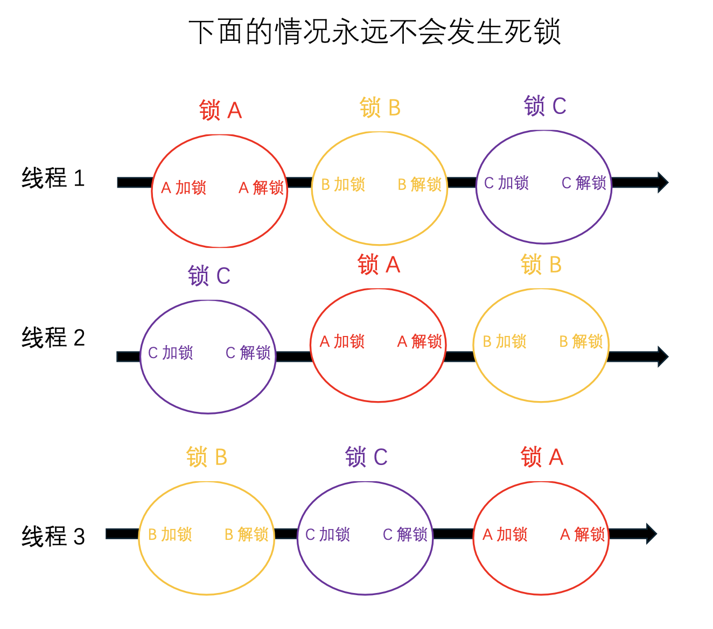
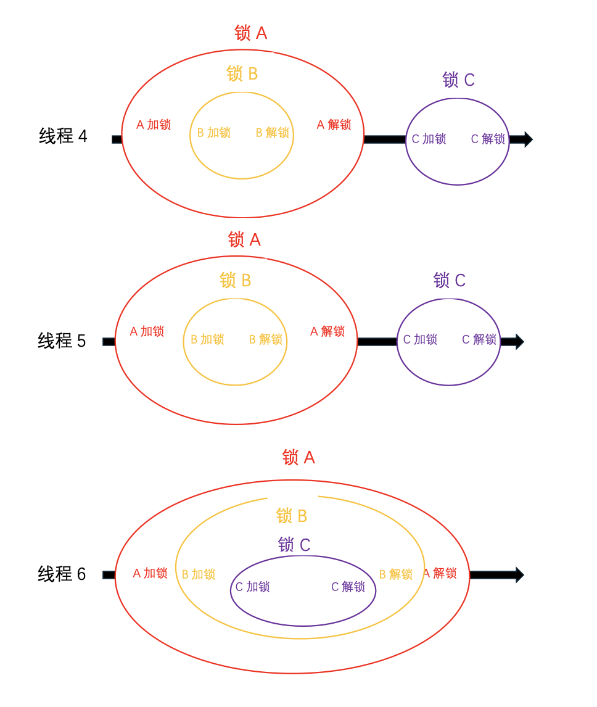

## 解决死锁问题—C++

#### 1、每个线程保证不同时拥有两把以上的锁，那么永远不会发生死锁

图中线程1、2、3永远不会发生死锁。锁ABC互不包含，任意顺序都不会死锁

#### 2、同时拥有多把锁时，每个线程保证使用锁的顺序保持一致，那么永远不会发生死锁

#### 3、同时拥有多把锁时，每个线程使用锁的顺序不一致，有可能发生死锁。

#### 4、同一线程对同一把互斥锁加锁多次，会导致死锁，应该使用递归锁代替。